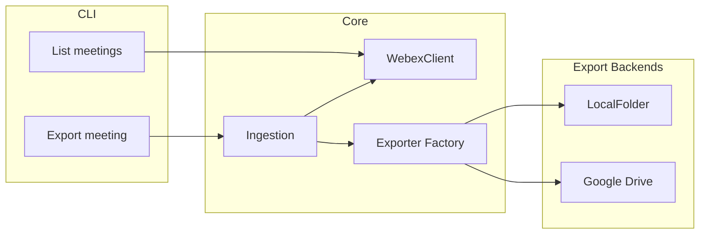

# Webex Meeting Data Exporter

Export Webex meeting data (recordings, transcripts, summaries, and action items) to a local folder or to Google Drive so you can use it with tools like Gemini. List and pick existing meetings to export.

## Quick Start

```bash
git clone https://github.com/WebexSamples/meetings-exporter.git
cd meetings-exporter
python3 -m venv .venv && source .venv/bin/activate
pip install -e ".[dev]"
cp env.template .env
# Edit .env and set WEBEX_ACCESS_TOKEN
meetings-exporter list --from 2026-02-01 --to 2026-02-28 --max 5
meetings-exporter export MEETING_ID --output-dir ./exports
```

## Table of Contents

- [Quick Start](#quick-start)
- [Prerequisites](#prerequisites)
- [Installation](#installation)
- [Configuration](#configuration)
- [Usage](#usage)
- [Export Backends](#export-backends)
- [Architecture](#architecture)
- [Project Structure](#project-structure)
- [Testing](#testing)
- [Contributing](#contributing)
- [Github Actions](#github-actions)
- [Installing Prettier via npm (Local Machine)](#installing-prettier-via-npm-local-machine)
- [Installing and Running Ruff Python Linter](#installing-and-running-ruff-python-linter)
- [Pre-Commit Hooks](#pre-commit-hooks)
- [Skipping Hooks](#skipping-hooks)
- [Roadmap](#roadmap)
- [License](#license)
- [Thanks!](#thanks)

## Prerequisites

- **Python 3.11 or later**
- **Webex account** and a [Personal Access Token](https://developer.webex.com/docs/getting-your-personal-access-token) (or OAuth2 app) from [developer.webex.com](https://developer.webex.com)
- **For Google Drive export only**: Google Cloud project with [Drive API enabled](https://console.cloud.google.com/apis/library/drive.googleapis.com) and OAuth client credentials

Meetings must be **individual instances** (not series) to get summaries, recordings, and transcripts. The app lists and exports instance meetings by default.

## Installation

1. **Clone the repository**

```bash
git clone https://github.com/WebexSamples/meetings-exporter.git
cd meetings-exporter
```

2. **Create a virtual environment and install the package**

```bash
python3 -m venv .venv
source .venv/bin/activate   # On Windows: .venv\Scripts\activate
pip install -e ".[dev]"
```

After this, the `meetings-exporter` command is available in that environment.

## Configuration

1. **Copy the environment template**

```bash
cp env.template .env
```

2. **Set your Webex access token** (required for list and export)

Edit `.env` and set:

```bash
WEBEX_ACCESS_TOKEN=your_personal_access_token_here
```

Get a token from [Webex for Developers](https://developer.webex.com/docs/getting-your-personal-access-token). No Google or OAuth setup is needed if you only export to a **local folder** (see Usage).

3. **Optional: Google Drive export**

To export to Google Drive instead of (or in addition to) local folder:

- Create a project in [Google Cloud Console](https://console.cloud.google.com), enable the Drive API, and create OAuth 2.0 credentials (Desktop app).
- Download the JSON key and set in `.env`:

```bash
EXPORT_BACKEND=google_drive
GOOGLE_CREDENTIALS_FILE=/path/to/your/credentials.json
```

On first run, the app will open a browser to complete OAuth and save a token.

## Usage

All commands require `WEBEX_ACCESS_TOKEN` in your environment (or in `.env`). Activate your venv before running.

**List recent meetings (individual instances only)**

```bash
meetings-exporter list --from 2026-02-01 --to 2026-02-28 --max 10
```

Use the meeting ID from the first column (it will look like `..._I_...` for instances).

**Export a single meeting to a local folder** (no Google or cloud setup needed)

```bash
meetings-exporter export MEETING_ID --output-dir /path/to/exports
```

**Export all meetings in a date range** (no meeting ID required)

```bash
meetings-exporter export --from 2026-02-01 --to 2026-02-28 --output-dir /path/to/exports
```

Optional: `--max N` (default 100) limits how many meetings to export. Each meeting gets its own subfolder.

This creates folders under the output path with names like `2026-02-05 14-00 - Meeting Title` (date-time first so they sort in order), containing `meeting_details.txt`, `transcript.vtt`, `summary.txt`, `summary.json`, and any recording files.

**Export to Google Drive** (requires Google credentials in `.env`)

```bash
meetings-exporter export MEETING_ID
# or by date range:
meetings-exporter export --from 2026-02-01 --to 2026-02-28
```

With `EXPORT_BACKEND=google_drive` and credentials configured, meetings are uploaded to Drive in the same structure.

## Export Backends

- **Local folder** (`--output-dir PATH`): Writes all assets to the given directory. No cloud credentials needed.
- **Google Drive** (`EXPORT_BACKEND=google_drive`): Uploads to Google Drive; requires OAuth credentials and optional `GOOGLE_DRIVE_FOLDER_ID` for a root folder.

OneDrive and Dropbox can be added later; the app is built so new backends plug in without changing ingestion logic.

## Architecture



The CLI calls `export_meeting()` in the ingestion layer, which fetches data via `WebexClient` and writes via the configured exporter. This design allows `export_meeting()` to be called programmatically (e.g. from a future webhook handler).

## Project Structure

- `src/meetings_exporter/` – Main package: Webex client, ingestion, exporters (local, Google Drive), CLI
- `env.template` – Environment variable template (copy to `.env`)
- `tests/` – Pytest tests for ingestion, exporters, and webhook utilities

## Testing

With the virtual environment activated and dev dependencies installed:

```bash
pytest tests/ -v
```

## Contributing

See [CONTRIBUTING.md](CONTRIBUTING.md) for setup, code style, and how to submit changes.

## Github Actions

This project uses GitHub Actions to enforce coding standards. These workflows run on every pull request and must pass before merging.

1. **Test**: Runs pytest. See [`.github/workflows/test.yml`](.github/workflows/test.yml).
2. **Ruff**: Lints Python. See [`.github/workflows/ruff.yml`](.github/workflows/ruff.yml).
3. **Prettier**: Checks formatting for JS/JSON/MD and other supported files. See [`.github/workflows/prettier.yml`](.github/workflows/prettier.yml).

## Installing Prettier via npm (Local Machine)

To format code locally:

```bash
npx prettier . --check    # Check only
npx prettier . --write    # Apply fixes
```

## Installing and Running Ruff Python Linter

```bash
pip install ruff
ruff check .           # Check only
ruff check --fix .     # Apply fixes
```

## Pre-Commit Hooks

The repo uses [Husky](https://github.com/typicode/husky) and [lint-staged](https://github.com/lint-staged/lint-staged). After `npm install`, the pre-commit hook runs Prettier and Ruff before each commit.

## Skipping Hooks

- Single commit: `git commit -m "..." -n`
- Temporary: `HUSKY=0 git ...` then `unset HUSKY` when done

## Roadmap

Webhooks (e.g. auto-export when a recording is ready) are planned for a future release. The codebase is structured to support this: `export_meeting()` can be called programmatically, and `webhook_utils` provides payload parsing for Webex events.

## License

This project is licensed under the [Cisco Sample Code License v1.1](LICENSE). Use is permitted only with Cisco products and services. See the LICENSE file for full terms.

## Thanks!

Made with care by the Webex Developer Relations Team at Cisco.
